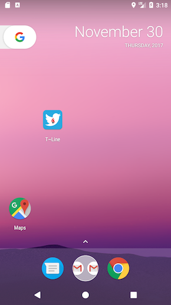
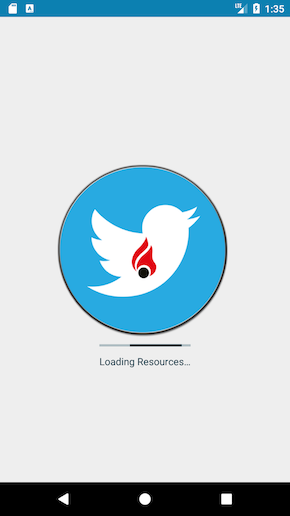
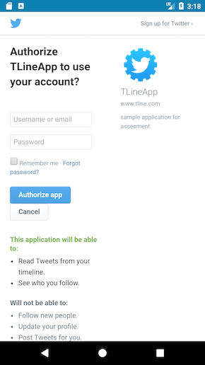
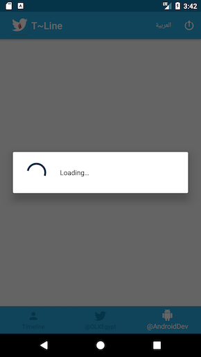
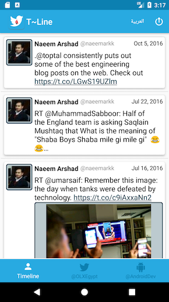
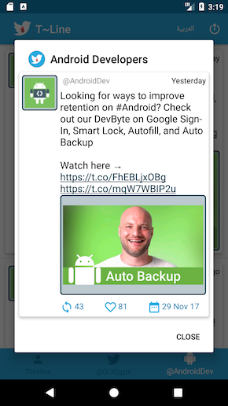
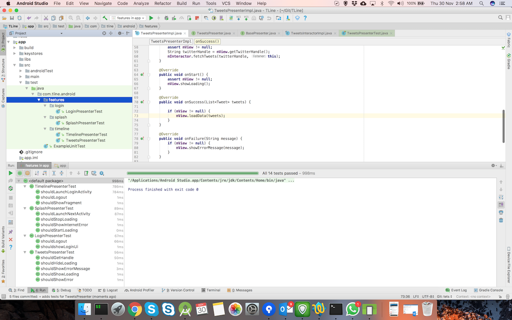
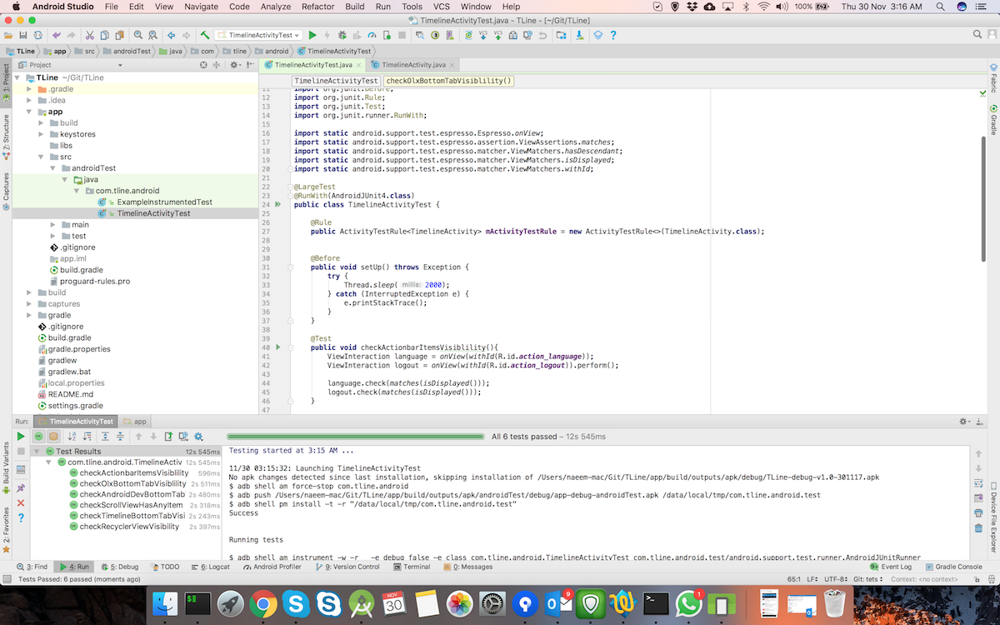

# T~Line #

A mocked application for Stream and Timeline.

### Why this Repository? ###

* This app is built as assignment. 
* Adds different libs to enhance the application quality and performance
* Version 1.0.0

### Application Flow ###

- A: User Clicks on App Icon for device
- B: Splash appear
- C: After splash delay, Login Screen Appears
- D: By Clicking login, it launches authentication screen for Twitter Kit
- E: On Successful login, you will see Timeline screen, with three tabs
- F: Actionbar button is there to switch the app language and logout

## How do I get set up? ##

### How to set up ###
To setup you need to clone this repo, from `master` or `develop` branch or some latest `TAG`

### Configuration ###
Please sync and resolve dependencies

### Requirements ###

- JDK 1.8
- [Android SDK](http://developer.android.com/sdk/index.html).
- Android N [(API 26) ](http://developer.android.com/tools/revisions/platforms.html)
- Latest Android SDK Tools and build tools.

### Tools included: ###

- Support libraries
- RecyclerViews and CardViews
- [RxJava](https://github.com/ReactiveX/RxJava) and [RxAndroid](https://github.com/ReactiveX/RxAndroid)
- [Retrofit 2](http://square.github.io/retrofit/)
- [Dagger 2](http://google.github.io/dagger/)
- [Butterknife](https://github.com/JakeWharton/butterknife)
- [Timber](https://github.com/JakeWharton/timber)
- [Glide](https://github.com/bumptech/glide)
- Functional tests with [Espresso](https://google.github.io/android-testing-support-library/docs/espresso/index.html)
- For enhancing functionality of JUnit4 [Mockito](http://mockito.org/)

## Storage ##
### Local Storage ###

- [`SharedPreferences`](https://developer.android.com/reference/android/content/SharedPreferences.html) are used for local persistance of preferences _(if required)_

### Resources ###

- [Dagger-Rx-Database-MVP](https://github.com/filippella/Dagger-Rx-Database-MVP)
- [MVP](https://hackernoon.com/yet-another-mvp-article-part-1-lets-get-to-know-the-project-d3fd553b3e21)
- [Clean Architecture](https://fernandocejas.com/2014/09/03/architecting-android-the-clean-way/)
- [Retrofit](http://square.github.io/retrofit/)

##### The MVP structure is based upon an Android Studio Plugin #####
-  _`Open Source`_
- https://github.com/benoitletondor/Android-Studio-MVP-template

## Code Quality ##

Used `Android Lint` and `Sonar Lint` for code quality checks

## Testing ##

Demonstrating TDD for the development.

#### Unit testing ####

- A small demonstration of Mokito is included to show, how we could test the app by JUnit

#### Instrumentational Testing ####

## Distribution ##

The project can be distributed using [Google Play Store](https://github.com/Triple-T/gradle-play-publisher).

## Contribution guidelines ##

- forks are always appreciated

## Screenshots ##

